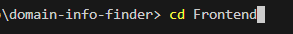
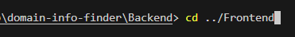
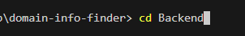
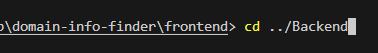

# Domain Info Finder

## Overviews

### Frontend Overview

-   The frontend is a simple React application that allows users to input a domain name and retrieve detailed domain and contact information.

### Backend Overview

-   The backend application is designed to provide users with comprehensive information about domain names by leveraging the Whois API. The app allows users to query specific domains and retrieve detailed registration data, ownership details, and other relevant metadata.

## Important Notes

### Frontend Notes

-   The frontend web app has limited responsiveness in its design.
-   The frontend application is designed to work exclusively with the backend server included in this repository. Please ensure that the backend is running and accessible for the application to function correctly.

### Backend Notes

-   You will need a Whois API Key for this backend server. Server will not work as intended without the Whois API Key. Instructions on how to obtain one are included below in the [Instructions to Obtain a Whois API Key](#instructions-to-obtain-a-whois-api-key) section.

## Table of Contents

-   [Installing Node](#installing-node)
    -   [Node Windows](#node-windows)
    -   [Node macOS](#node-macos)
    -   [Node Linux](#node-linux)
-   [Installing Git](#installing-git)
    -   [Git Windows](#git-windows)
    -   [Git macOS](#git-macos)
    -   [Git Linux](#git-linux)
-   [Cloning the repository](#cloning-the-repository)
-   [Frontend](#frontend)
    -   [Frontend Features](#frontend-features)
    -   [Frontend Technologies](#frontend-technologies)
    -   [Getting Started with the Frontend](#getting-started-with-the-frontend)
    -   [Frontend Usage](#frontend-usage)
-   [Backend](#backend)
    -   [Backend Features](#backend-features)
    -   [Backend Technologies](#backend-technologies)
    -   [Instructions to Obtain a Whois API Key](#instructions-to-obtain-a-whois-api-key)
    -   [Getting Started with the Backend](#getting-started-with-the-backend)
    -   [Backend Usage](#backend-usage)
-   [Contributing](#contributing)
-   [License](#license)

## Installing Node

### Node Windows

1. **Download the Installer**:

    - Go to the [Node.js website](https://nodejs.org/).
    - Download the Windows Installer (LTS version is recommended).

2. **Run the Installer**:

    - Open the downloaded file and follow the installation prompts.
    - Ensure that you check the box that says “Automatically install the necessary tools” if prompted.

3. **Verify Installation**:
    - Open Command Prompt (search for "cmd").
    - Type the following command:
        ```bash
        node -v
        ```
    - You should see the installed version of Node.js.

### Node macOS

1. **Using Homebrew (Recommended)**:

    - Open Terminal.
    - If you don’t have Homebrew, install it by pasting this command:
        ```bash
        /bin/bash -c "$(curl -fsSL https://raw.githubusercontent.com/Homebrew/install/HEAD/install.sh)"
        ```
    - Once Homebrew is installed, run:
        ```bash
        brew install node
        ```

2. **Verify Installation**:
    - In Terminal, type:
        ```bash
        node -v
        ```

### Node Linux

1. **Using Package Manager**:

    - For **Debian/Ubuntu**:

        ```bash
        sudo apt update
        sudo apt install nodejs npm
        ```

    - For **Fedora**:

        ```bash
        sudo dnf install nodejs
        ```

    - For **Arch**:
        ```bash
        sudo pacman -S nodejs npm
        ```

2. **Verify Installation**:
    - Type in Terminal:
        ```bash
        node -v
        ```

## Installing Git

### Git Windows

1. **Download the Installer**:

    - Go to the [Git for Windows website](https://gitforwindows.org/).
    - Download the latest version of the installer.

2. **Run the Installer**:

    - Open the downloaded file and follow the installation prompts.
    - You can leave most options at their defaults unless you have specific preferences.

3. **Verify Installation**:
    - Open Command Prompt (search for "cmd").
    - Type the following command:
        ```bash
        git --version
        ```
    - You should see the installed version of Git.

### Git macOS

1. **Using Homebrew (Recommended)**:

    - Open Terminal.
    - Run:
        ```bash
        brew install git
        ```

2. **Verify Installation**:

    - In Terminal, type:
        ```bash
        git --version
        ```

3. **Alternative Method**:
    - You can also install Git by downloading the [latest installer from the Git website](https://git-scm.com/download/mac).

### Git Linux

1. **Using Package Manager**:

    - For **Debian/Ubuntu**:

        ```bash
        sudo apt update
        sudo apt install git
        ```

    - For **Fedora**:

        ```bash
        sudo dnf install git
        ```

    - For **Arch**:
        ```bash
        sudo pacman -S git
        ```

2. **Verify Installation**:
    - Type in Terminal:
        ```bash
        git --version
        ```

## Cloning the repository

    git clone https://github.com/georgecabaccang/domain-info-finder.git
    cd domain-info-finder

# Frontend

## Frontend Features

-   Input a domain name to fetch domain information.
-   View details associated with the domain.

## Frontend Technologies

This project is built with the following technologies:

-   [React](https://reactjs.org/) - JavaScript library for building user interfaces.
-   [TypeScript](https://www.typescriptlang.org/) - Typed superset of JavaScript.
-   [Axios](https://axios-http.com/) - Promise-based HTTP client for making requests.
-   [Vite](https://vitejs.dev/) - Build tool that provides a fast development experience.

## Getting Started with the Frontend

To get started with the Frontend application, follow these steps:

1. **Get inside the Frontend directory:**

    - If you are in the root directory:

    ```bash
    cd Frontend
    ```

    

    - If you are in the Backend directory:

    ```bash
    cd ../Frontend
    ```

    

2. **Install dependencies:**

    ```bash
    npm install
    ```

3. **Set up .env file:**

    - In the root directory of Frontend, there should be a .env.example.
    - Rename .env.example to .env.
    - Update the PORT variable in the .env file to match your backend server's port if you decide to change the PORT of the backend server.
    - Default of backend is 5500

4. **Change PORT of frontend (optional):**

    - Default is 5000
    - Change port on which the app will run on in the vite.config.ts file.

5. **Start the development server:**

    ```bash
    npm run dev
    ```

The frontend application should now be runnig on [http://localhost:5000](http://localhost:5000)

## Frontend Usage

-   Enter a domain name in the input field and submit to retrieve the domain and contact information.

-   Examples
    -   google.com
    -   amazon.com
    -   w3schools.com
    -   sourceforge.net
    -   example-domain.com
    -   example-domain.net

# Backend

## Backend Features

-   **Domain Lookup**: Users can input a domain name to fetch information such as registration status, expiration date, and registrant details.
-   **Real-Time Data**: The application retrieves up-to-date information from the Whois API, ensuring that users have access to the latest domain records.
-   **Error Handling**: The app includes robust error handling to manage invalid domain queries or API errors gracefully, providing users with clear feedback.
-   **CORS Support**: The application has Cross-Origin Resource Sharing (CORS) enabled, allowing it to be accessed from different origins and making it suitable for integration with frontend applications.

## Backend Technologies

This project is built with the following technologies:

-   [Node.js](https://nodejs.org/) - JavaScript runtime built on Chrome's V8 JavaScript engine.
-   [TypeScript](https://www.typescriptlang.org/) - Typed superset of JavaScript that compiles to plain JavaScript.
-   [Axios](https://axios-http.com/) - Promise-based HTTP client for making requests.
-   [Express](https://expressjs.com/) - Fast, unopinionated, minimalist web framework for Node.js.
-   [CORS](https://developer.mozilla.org/en-US/docs/Web/HTTP/CORS) - Middleware to enable Cross-Origin Resource Sharing.

## Instructions to Obtain a Whois API Key

1. **Go to the Whois API website and Log In or Sign Up**

    - This click the link [Whois API website](https://main.whoisxmlapi.com/login) to log in or sign up if you have not account yet.

2. **Find your API Key**

    - After logging in, click on your avatar with your name beside it, which is located at the upper right side of the web page, and click on the "My Products" option in the drop down list.

        

3. **Copy your API Key**

    - Copy your API key by clicking on the copy icon or by highlighting and copying the API Key string.

        

## Getting Started with the Backend

To get started with the Backend application, follow these steps:

1. **Get inside the Backend directory:**

    - If you are in the root directory:

    ```bash
    cd Backend
    ```

    

    - If you are in the Frontend directory:

    ```bash
    cd ../Backend
    ```

    

2. **Install dependencies:**

    ```bash
    npm install
    ```

3. **Set up .env file:**

    - In the root directory of Backend, there should be a .env.example.
    - Rename .env.example to .env.
    - Inside the .env file, there should be a variable for your WHOIS_API_KEY without any value. Paste your copied API key after the equal (=) sign. If you still don't have an API key, please follow the instructions on how to obtain one here: [Instructions to Obtain a Whois API Key](#instructions-to-obtain-a-whois-api-key).

4. **Changing PORT of server (optional):**

    - Default is 5500
    - You can change the PORT on which the server will run in the .env file. Change the value of the constant variable PORT to a valid port number of your choosing.
    - If you do change the PORT of the server, please also update the value of the localhost in the .env file of the frontend directory.

5. **Start the development server:**

    ```bash
    npm run server
    ```

The backend application should now be runnig on [http://localhost:5500](http://localhost:5500)

## Backend Usage

This backend application exposes a single endpoint for retrieving domain information.

### Endpoint

**GET** `/:domainName`

### Parameters

-   `domainName` (path parameter): The domain name you want to query. For example, `example.com`.

### Example Request Using Postman

-   http://localhost:5500/example.com
-   Please take note of the port the server is running on.

### Example Response

```{
    "domainInfo": {
        "Domain Name": "example.com",
        "Registrar Name": "Example, Inc.",
        "Registration Date": "Jan 1, 2000",
        "Expiration Date": "Jan 1, 2028",
        "Estimated Domain Age": 27,
        "Host Names": [
            "X.EXAMPLE.COM",
            "Y.EXAMPLE.COM",
        ]
    },
    "contactInfo": {
        "Registrant Name": "Example Person Name",
        "Technical Contact Name": "Example Tech Person Name",
        "Administrative Contact Name": "Example Admin Name",
        "Contact Email": "example@email.com"
    }
}
```

### Error Handling

```
{
    "error": {
        "message": "Unauthorized. (API Key used by server)",
        "statusCode": 401
    }
}
```

## Contributing

If you'd like to contribute to this project, please follow these steps:

1. Fork the repository.
2. Create a new branch:

    ```bash
    git checkout -b <name-of-your-branch>
    ```

3. Make your changes and commit them:

    ```bash
    git add . --- For all files/folders
    git add example.ts --- For a single file
    git add folderName --- For a folder

    git commit -m "Brief description of your changes"
    ```

4. Push your changes to your forked repository:

    - If the branch you're pushing DOES NOT EXIST in the remote repo:

    ```bash
    git push -u origin <name-of-your-branch>
    ```

    - If the branch you're pushing DOES EXIST in the remote repo:

    ```bash
    git push origin <name-of-your-branch>
    ```

5. Create a pull request:

    - Go to the original repository where you want to contribute.
    - Click on the "Pull Requests" tab.
    - Click the "New Pull Request" button.
    - Select your branch and submit the pull request with a clear description of your changes.

6. Respond to any feedback:

    - Be open to suggestions or requests for changes from the project maintainers.
    - Make any necessary updates in your branch and push them again.

7. Celebrate and be proud of your contribution!

Thank you for helping to improve this project! If you have any questions, feel free to reach out.

## License

-   This project is free to use for personal and educational purposes.
-   You must give credit to the original author (me! 😊).
-   Commercial use is not allowed without permission.
